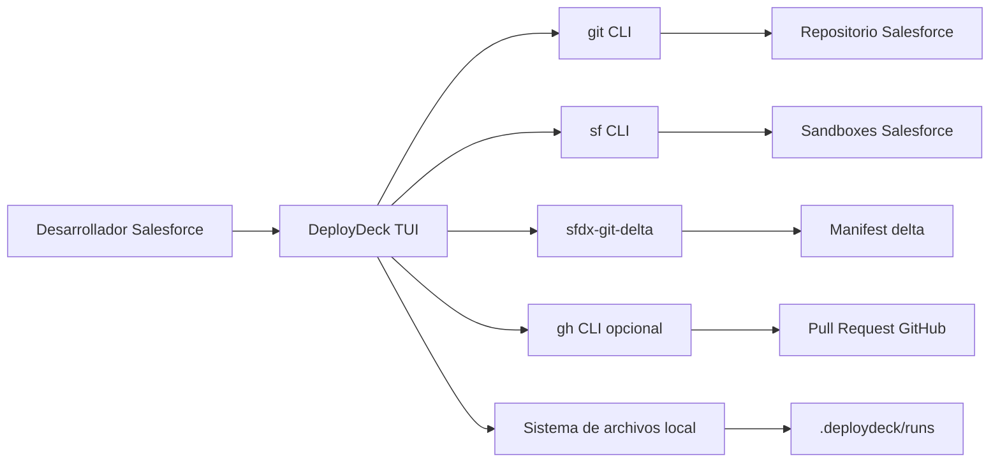
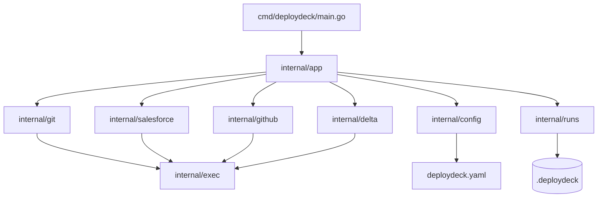
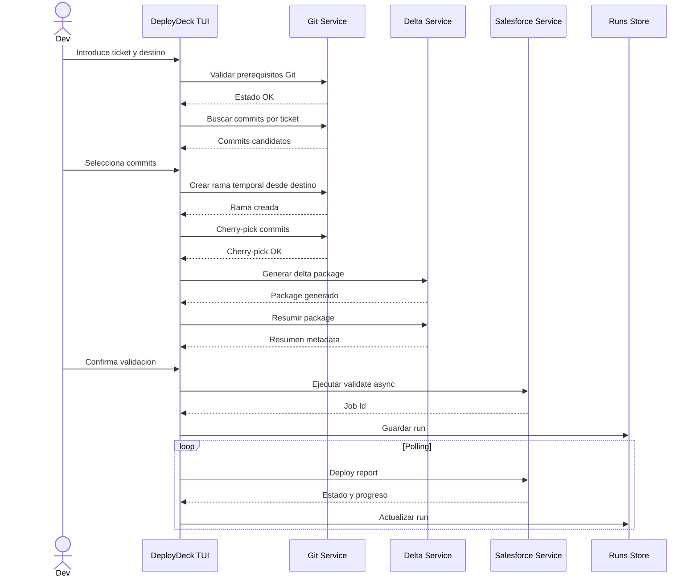
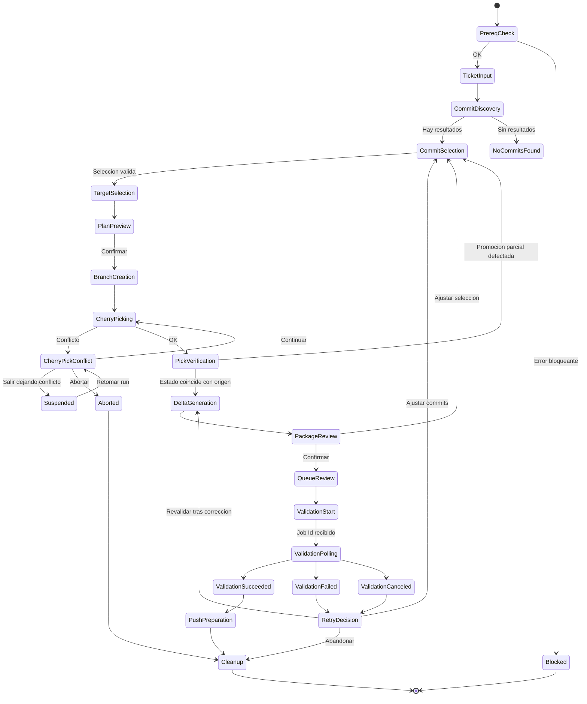

# Arquitectura Tecnica - DeployDeck

## Objetivo Arquitectonico

DeployDeck debe ser una TUI en Go que coordina Git, Salesforce CLI y `sfdx-git-delta` sin ocultar el estado real del repositorio ni guardar credenciales.

El principio central es separar la UI de la ejecucion operativa. La TUI no debe contener comandos Git o Salesforce directamente; debe invocar servicios internos testeables.

## Vista De Contexto



## Modulos Principales



## Responsabilidades Por Modulo

### `cmd/deploydeck`

- Punto de entrada del binario.
- Inicializa Cobra si se usa CLI hibrida.
- Carga configuracion inicial.
- Arranca Bubble Tea.

### `internal/app`

- Contiene modelo de estado TUI.
- Define pantallas, transiciones y comandos Bubble Tea.
- No ejecuta comandos externos directamente.
- Coordina servicios de dominio.

### `internal/exec`

- Ejecuta comandos externos.
- Aplica timeout y cancelacion por contexto.
- Captura stdout, stderr, exit code y duracion.
- Soporta dry-run futuro.
- Devuelve errores estructurados.

### `internal/git`

- Valida repo y working tree.
- Lista ramas.
- Busca commits.
- Detecta commits equivalentes ya aplicados por contenido (`git cherry` / patch-id), no solo por SHA.
- Ordena commits topologicamente para cherry-pick.
- Crea ramas temporales.
- Ejecuta cherry-picks, incluyendo manejo de pick vacio (`--skip`) y abort parcial.
- Verifica estado final post cherry-pick contra la rama origen (deteccion de promocion parcial).
- Detecta dependencias por fichero: commits intermedios no seleccionados que tocan los mismos ficheros.
- Ejecuta push.
- Limpia ramas temporales y restaura la rama original.
- Gestiona lock de instancia unica por repo.

### `internal/salesforce`

- Lista orgs y valida alias.
- Ejecuta deploy validate.
- Consulta deploy report.
- Consulta cola de deploys.
- Cancela job propio.
- Prepara quick deploy futuro.

### `internal/github`

- Detecta disponibilidad y autenticacion de `gh` (`gh auth status`).
- Crea PR con `gh pr create` previa confirmacion explicita del usuario.
- Deriva la URL de compare desde el remoto `origin` como fallback sin `gh`.
- Dependencia opcional: su ausencia nunca bloquea el flujo.

### `internal/delta`

- Ejecuta `sf sgd source delta`.
- Localiza artefactos generados.
- Parsea `package.xml`.
- Parsea destructive changes.
- Resume metadata por tipo.

### `internal/config`

- Carga configuracion YAML.
- Aplica defaults.
- Valida estructura.
- Expone ramas, sandboxes, source dirs y patrones.

### `internal/runs`

- Crea y actualiza runs locales.
- Guarda logs y JSON raw.
- Lista historial.
- Permite reanudar por `jobId`.

## Flujo Principal



## Maquina De Estados Del Flujo



## Arquitectura De Persistencia Local

Todo lo que DeployDeck genera vive bajo `.deploydeck/` en la raiz del repo, incluidos los manifests delta. El directorio completo debe estar en `.gitignore` del repo Salesforce — es un chequeo bloqueante del doctor — para que los artefactos nunca ensucien el working tree que la propia herramienta exige limpio.

```text
.deploydeck/
  lock
  manifest/
    delta/
      OTACUPYR-1386-to-UAT/
        package/package.xml
        destructiveChanges/destructiveChanges.xml
  runs/
    20260702-101400-OTACUPYR-1386-UAT/
      run.json
      logs/
        git-fetch.log
        cherry-pick-0f95dd3e.log
        sgd.log
        validate.log
      raw/
        org-list.json
        validate-response.json
        deploy-report-001.json
        deploy-report-002.json
```

Modelo recomendado:

```go
type RunRecord struct {
    ID                 string    `json:"id"`
    Ticket             string    `json:"ticket"`
    SourceBranch       string    `json:"sourceBranch,omitempty"`
    TargetBranch       string    `json:"targetBranch"`
    TargetOrg          string    `json:"targetOrg"`
    DeployBranch       string    `json:"deployBranch"`
    JobID              string    `json:"jobId,omitempty"`
    Status             string    `json:"status"`
    CreatedAt          time.Time `json:"createdAt"`
    UpdatedAt          time.Time `json:"updatedAt"`
    Commits            []string  `json:"commits"`
    PickIndex          int       `json:"pickIndex,omitempty"`
    PickTotal          int       `json:"pickTotal,omitempty"`
    CurrentCommit      string    `json:"currentCommit,omitempty"`
    TestLevel          string    `json:"testLevel,omitempty"`
    PackageXML         string    `json:"packageXml,omitempty"`
    DestructiveChanges string    `json:"destructiveChanges,omitempty"`
    PRUrl              string    `json:"prUrl,omitempty"`
    SourceRunID        string    `json:"sourceRunId,omitempty"`
}
```

## Contrato Del Wrapper De Ejecucion

```go
type CommandRequest struct {
    Name       string
    Args       []string
    Dir        string
    Timeout    time.Duration
    Env        []string
    RedactArgs []string
}

type CommandResult struct {
    Name      string
    Args      []string
    ExitCode  int
    Stdout    []byte
    Stderr    []byte
    StartedAt time.Time
    EndedAt   time.Time
    Duration  time.Duration
}
```

Reglas:

- No ejecutar via shell salvo necesidad explicita.
- Pasar argumentos como slice.
- Capturar stdout y stderr por separado.
- No guardar credenciales.
- Redactar valores sensibles si aparecen en argumentos futuros.
- Ejecutar Git siempre de forma no interactiva: `GIT_EDITOR=true`, `GIT_TERMINAL_PROMPT=0`, `GIT_PAGER=cat`. Sin esto, `git cherry-pick --continue` abre un editor y cuelga el proceso indefinidamente. Ojo tambien con GPG signing configurado en el repo (puede pedir passphrase).
- Los handoffs interactivos deliberados ($EDITOR, `git mergetool`) no pasan por este wrapper: usan `tea.ExecProcess` desde `internal/app`, que cede la terminal y la recupera al salir.

## Configuracion

Archivo recomendado por repo:

```text
deploydeck.yaml
```

Ejemplo:

```yaml
branches:
  integration: INT
  uat: UAT
  production: main

sandboxes:
  INT:
    alias: INT_SANDBOX
    testLevel: RunLocalTests
  UAT:
    alias: UAT_SANDBOX
    testLevel: RunLocalTests
  "Release/*":
    alias: PREPROD_SANDBOX
    testLevel: RunLocalTests
  main:
    alias: PROD
    testLevel: RunLocalTests

delta:
  outputDir: .deploydeck/manifest/delta
  sourceDirs:
    - up_saln0001_giss_salesforce/force-app
  ignoreFile: .sgdignore
  ignoreDestructiveFile: .sgd-destructive-ignore

ticketPatterns:
  - "OTACUPYR-[0-9]+"
  - "INC[0-9]+"

branchFormat: "deploy/{{ticket}}-to-{{target}}"
pollIntervalSeconds: 10

runs:
  keepLast: 30
  keepDays: 90

minVersions:
  git: "2.30.0"
  sf: "2.0.0"
  sfdx-git-delta: "5.0.0"
```

## Estrategia De Testing

### Tests Unitarios

- Parsing de commits Git.
- Deteccion de merge commits.
- Deteccion de equivalencia por patch-id / `git cherry`.
- Deteccion de dependencias por fichero (commits intermedios no seleccionados).
- Ordenacion topologica de commits.
- Parsing de `package.xml`.
- Parsing de destructive changes.
- Parsing de JSON de `sf project deploy validate`.
- Parsing de JSON de `sf project deploy report`.
- Validacion de config YAML.

### Tests De Integracion Local

- Repo Git temporal con ramas y commits.
- Cherry-pick exitoso.
- Cherry-pick con conflicto.
- Cherry-pick vacio (cambio ya aplicado con otro SHA) y `--skip`.
- Abort a mitad de secuencia con limpieza de rama parcial.
- Verificacion post-pick: estado final igual y distinto al de la rama origen.
- Generacion de rama temporal.

### Tests Manuales

- Validacion contra sandbox INT.
- Polling hasta resultado terminal.
- Reanudacion de run existente.
- Consulta de cola de deploys.

## Decisiones Tecnicas Recomendadas

### DEC-001 - Politica De Merge De PRs De Promocion (Proceso Externo)

DeployDeck **no mergea PRs**: solo prepara el push y los datos del PR. El merge ocurre en GitHub segun la configuracion del repo, fuera del alcance de la herramienta. DEC-001 es por tanto una recomendacion de proceso al equipo, no un comportamiento de DeployDeck:

- Recomendacion: mergear los PR de promocion (`deploy/* -> destino`) con **merge commit, no squash**, para preservar los SHAs y patch-ids de los commits individuales entre ambientes. De ello depende la fiabilidad de la deteccion de "ya aplicado" por equivalencia (`git cherry`).
- Obligacion de la herramienta: funcionar con cualquier politica de merge. Si el historial del destino sugiere squash merges, avisar que la deteccion estatica de equivalencia degrada y apoyarse en el manejo de cherry-pick vacio (`--skip`) como red de seguridad.
- Estado: recomendacion pendiente de trasladar al equipo y a la configuracion del repo en GitHub.

### Otras Decisiones

- Implementar primero servicios y CLI minima antes de pulir TUI.
- Una sola rama origen por run: no se mezclan commits de ramas distintas (no existe orden topologico comun).
- Para promociones entre ambientes, la fuente por defecto es el ambiente anterior (lo validado en sandbox), no la rama feature.
- Orden de cherry-pick topologico, nunca cronologico.
- Bloquear seleccion de merge commits en MVP.
- Lock file por repo (`.deploydeck/lock`) para evitar instancias concurrentes.
- Resolucion de conflictos: la TUI espera con deteccion activa (relee el estado del repo periodicamente) y el usuario resuelve con su herramienta preferida; los atajos $EDITOR/mergetool son opcionales. La fuente de verdad del estado es siempre el repo (`CHERRY_PICK_HEAD`, `.git/sequencer`, index), nunca la maquina de estados interna: cualquier accion externa del usuario se reconcilia al refrescar.
- Sugerir `git rerere` para reaplicar resoluciones al re-promocionar el mismo ticket entre ambientes.
- Usar `--json` en todos los comandos Salesforce que lo soporten.
- No parsear salida humana salvo fallback documentado.
- No resolver conflictos Git automaticamente.
- No ejecutar quick deploy por defecto.
- Persistir run apenas exista riesgo de perder contexto.
- Mantener configuracion por repo, no global, para alinear ramas y sandboxes del equipo.

## Riesgos Arquitectonicos

| Riesgo | Impacto | Mitigacion |
| --- | --- | --- |
| Repo queda en cherry-pick intermedio | Alto | Detectar `CHERRY_PICK_HEAD`, mostrar instrucciones, permitir continue/abort |
| JSON de Salesforce cambia | Medio | Tests con fixtures, guardar raw, aislar parsing |
| Delta incompleto | Alto | Resumen visible, warnings, fallback manual |
| Usuarios con CLI distinta | Medio | `doctor`, versiones minimas, mensajes accionables |
| Polling infinito | Medio | Timeout, estados terminales, cancelacion por contexto |
| Jobs ajenos cancelados | Alto | Solo permitir cancelar job del run actual |
| Squash merges rompen deteccion de equivalencia | Alto | DEC-001 + deteccion de pick vacio con `--skip` |
| Promocion parcial de ficheros compartidos entre tickets | Alto | Warning de dependencias en seleccion + verificacion post-pick contra rama origen |
| Perfil sin permisos Tooling API para la cola | Medio | Cola opcional: avisar y continuar sin bloquear el flujo |
| Hooks del repo (husky, pre-commit) interfieren en checkout/cherry-pick | Medio | Detectar en doctor y documentar workaround |
| sgd no soporta multiples `--source-dir` | Medio | Spike al inicio de Fase 2; fallback: iterar por directorio y fusionar packages |
| Dos instancias concurrentes sobre el mismo repo | Alto | Lock file `.deploydeck/lock` con deteccion de proceso vivo |
